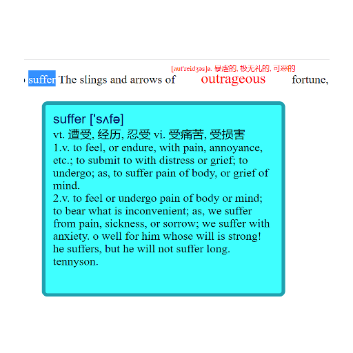

# WordWise
---

A chrome extension helps user learning new words in browser.

# Basic Function
---
## WordWise
This function is dramatically helpful on kindle especially for kids. However, when people visit websites, they have to lookup each word by themselves. Even some extensions help translate the content, they provide customized functions.
Installed this extension, the interface of content will change to the following view:

## Note

---
>The code is still under development due to time constraints.
---